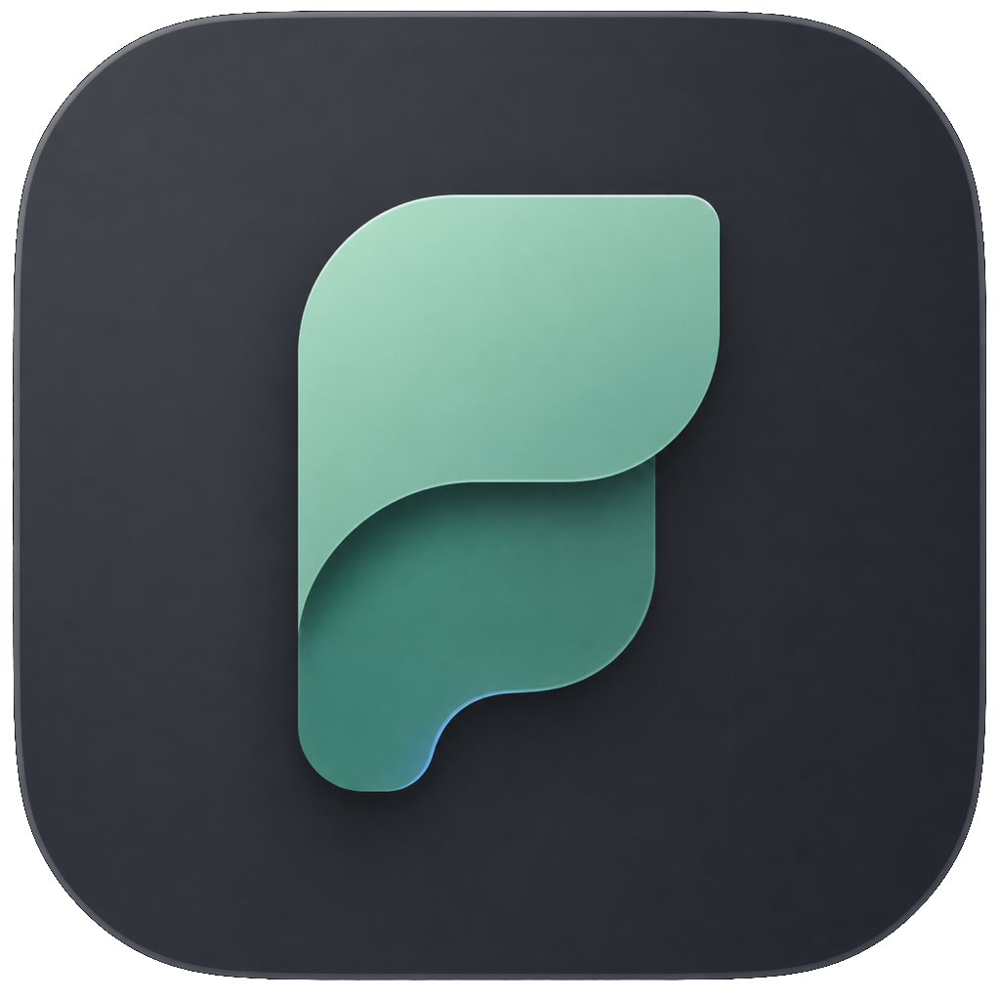

<div align="center">
  
  <h1>Fylune</h1>
  <p><strong>Your documents. Your files. Ready for AI.</strong></p>
  <p>A fast, local-first workspace for Markdown, MDX, JSON, spreadsheets, images, PDFs, and presentations.</p>

  [](https://github.com/georgezouq/fylune/actions/workflows/ci.yml)
  [](LICENSE)
  [](https://fylune.com)
  [](https://fylune.com)
  [](#privacy-by-design)
</div>

<p align="center">
  <a href="#quick-start"><strong>Quick start</strong></a> ·
  <a href="#what-fylune-does">Features</a> ·
  <a href="#agent-ready-by-design">Agents</a> ·
  <a href="#architecture">Architecture</a> ·
  <a href="CONTRIBUTING.md">Contributing</a> ·
  <a href="SECURITY.md">Security</a>
</p>


<div align="center">
  <video src="docs/media/fylune-product-tour.mp4" controls poster="docs/media/fylune-product-tour-poster.png" width="960">
    <a href="docs/media/fylune-product-tour.mp4">Watch the Fylune product tour</a>
  </video>
  <br>
  <a href="https://youtu.be/Nx4XbTozFWw"><strong>Watch the product tour on YouTube ↗</strong></a> ·
  <a href="docs/media/fylune-product-tour.mp4">Download MP4</a>
</div>

## Why Fylune

Most document apps ask you to import, upload, or surrender ownership of your files. Fylune opens the folders you already use and keeps ordinary files as the source of truth. The core workspace works without an account, an internet connection, or a hosted service.

## What Fylune does

- **Works with real folders** — browse, search, edit, rename, and organize files in place.
- **Edits Markdown and MDX** — rich editing without abandoning portable source files.
- **Handles structured data** — JSON and JSONL editing with syntax highlighting, folding, validation, search, and bracket matching.
- **Opens office files** — preview and edit spreadsheets, plus preview Word and PowerPoint documents.
- **Treats media as first-class files** — image, video, audio, and PDF previews live in the same tab model.
- **Reviews external changes safely** — every write is checked against the content the editor last read, so mismatches become reviewable conflicts.
- **Works with AI agents** — a local Agent protocol lets tools preview and safely apply changes to the same files you see in Fylune.
- **Optional self-hosted AI** — point the account API at OpenRouter (or another OpenAI-compatible endpoint) with your own server-side key.
- **Runs offline** — account registration is optional and never gates local editing.

## Agent-ready by design

Fylune provides a local JSON-RPC protocol for AI agents. Bring your own agent or automation and let it work in the same real workspace without uploading documents to Fylune:

- Discover open workspaces and read documents through an authenticated local connection.
- Stream text or structured patches into a live preview before committing them.
- Apply changes atomically with expected-content checks, snapshots, and three-way merging.
- Preserve overlapping edits as reviewable conflicts instead of silently overwriting user work.

The connection uses a per-launch capability token and a local Unix socket or Windows named pipe. No account, hosted model, or internet connection is required. With Fylune running, contributors can inspect the protocol using the included CLI:

```bash
pnpm --filter @fylune/desktop agent:rpc workspace.list
```

### Optional self-hosted Agent API

The open-source backend exposes an authenticated OpenAI-compatible Agent endpoint without sending workspace files to Fylune:

```bash
OPENROUTER_API_KEY=replace-me
OPENROUTER_TEXT_MODEL=openai/gpt-4o-mini
pnpm dev
```

Use `GET /ai/agent/status` to verify configuration and `POST /ai/agent/v1/chat/completions` for model responses. Keep the provider key in the backend `.env`; it is never shipped to Electron. To edit a document, an external Agent can combine the response with the local JSON-RPC protocol, preview the patch, and apply it with an expected-content check.

## Quick start

### Requirements

- Node.js 22+
- pnpm 10.26+
- Docker Desktop only if you want to run the optional account API

### Desktop only

```bash
git clone https://github.com/georgezouq/fylune.git
cd fylune
corepack enable
pnpm install --frozen-lockfile
pnpm dev:desktop
```

The desktop app opens with a fully local profile. No backend is required.

### Desktop with optional accounts

```bash
cp .env.example .env
pnpm db:up
pnpm db:generate
pnpm db:migrate
pnpm dev
```

The local API listens on `127.0.0.1:4318`; PostgreSQL stays on `127.0.0.1:55434`.

## Architecture

```text
fylune/
├── packages/desktop/                 Electron + React desktop application
├── packages/backend/                 Optional NestJS account API
├── packages/components/              Shared local editor and renderer surfaces
└── packages/document-collaboration/  Deterministic three-way merge primitives
```

The desktop process owns filesystem access and exposes a small validated IPC surface to the sandboxed renderer. Documents remain on disk. The optional API stores only users and refresh sessions; it has no document, workspace, upload, or storage endpoints.

## Privacy by design

- Document content, names, paths, and workspace metadata stay on the device.
- Local editing never requires login or connectivity.
- Files are written only after an expected-content check.
- No telemetry is included in the open-source build.
- The optional backend can be self-hosted and contains authentication plus an opt-in Agent proxy; it does not store documents or workspace metadata.

## Build and verify

```bash
pnpm db:generate
pnpm lint
pnpm typecheck
pnpm test
pnpm build
pnpm --filter @fylune/desktop pack
```

## Scope

This repository is the community edition of Fylune. It intentionally excludes the hosted website, payments, subscriptions, usage credits, cloud storage, document sharing, and cloud sync. AI is opt-in and self-hosted: the provider key and model access belong to the operator of the backend, not Fylune. None of these services are required for the local editing loop.

## Contributing

Bug reports, focused fixes, accessibility improvements, file-format compatibility work, and performance improvements are welcome. Read [CONTRIBUTING.md](CONTRIBUTING.md) before opening a pull request and use [GitHub Discussions](https://github.com/georgezouq/fylune/discussions) for open-ended product ideas.

## Security

Please do not open public issues for vulnerabilities. Follow the private reporting process in [SECURITY.md](SECURITY.md).

## License

Fylune is licensed under the [GNU Affero General Public License v3.0](LICENSE).
